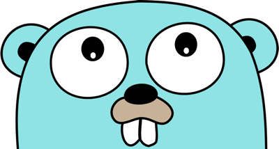

# jwt (JSON Web Token for Go)

<p align="center">
  
</p>

<p align="center">
  
</p>

<p align="center">
  <a target="_blank" href="https://travis-ci.org/gbrlsnchs/jwt"></a>
  <a target="_blank" href="https://goreportcard.com/report/github.com/gbrlsnchs/jwt"></a>
  <a target="_blank" href="https://sourcegraph.com/github.com/gbrlsnchs/jwt?badge"></a>
  <a target="_blank" href="https://godoc.org/github.com/gbrlsnchs/jwt"></a>
  <a target="_blank" href="https://golang.org/doc/go1.11"></a>
  <a target="_blank" href="https://gitter.im/gbrlsnchs/jwt?utm_source=badge&utm_medium=badge&utm_campaign=pr-badge&utm_content=badge"></a>
</p>

<p align="center">
  <a target="_blank" href="https://jwt.io"></a>
</p>

## Important
Branch `master` is unstable, **always** use tagged versions. That way it is possible to differentiate pre-release tags from production ones.
In other words, API changes all the time in `master`. It's a place for public experiment. Thus, make use of the latest stable version via Go modules.

## About
This package is a JWT signer, verifier and validator for [Go](https://golang.org) (or Golang).

Although there are many JWT packages out there for Go, many lack support for some signing, verifying or validation methods and, when they don't, they're overcomplicated. This package tries to mimic the ease of use from [Node JWT library](https://github.com/auth0/node-jsonwebtoken)'s API while following the [Effective Go](https://golang.org/doc/effective_go.html) guidelines.

Support for [JWE](https://tools.ietf.org/html/rfc7516) isn't provided. Instead, [JWS](https://tools.ietf.org/html/rfc7515) is used, narrowed down to the [JWT specification](https://tools.ietf.org/html/rfc7519).

### Supported signing methods
|         | SHA-256            | SHA-384            | SHA-512            |
|:-------:|:------------------:|:------------------:|:------------------:|
| HMAC    | :heavy_check_mark: | :heavy_check_mark: | :heavy_check_mark: |
| RSA     | :heavy_check_mark: | :heavy_check_mark: | :heavy_check_mark: |
| RSA-PSS | :heavy_check_mark: | :heavy_check_mark: | :heavy_check_mark: |
| ECDSA   | :heavy_check_mark: | :heavy_check_mark: | :heavy_check_mark: |
| EdDSA   | :heavy_minus_sign: | :heavy_minus_sign: | :heavy_check_mark: |

## Usage
Full documentation [here](https://godoc.org/github.com/gbrlsnchs/jwt).

### Installing
`go get -u github.com/gbrlsnchs/jwt/v3`

### Importing
```go
import (
	// ...

	"github.com/gbrlsnchs/jwt/v3"
)
```

### Signing a simple JWT
```go
now := time.Now()
hs256 := jwt.NewHMAC(jwt.SHA256, []byte("secret"))
h := jwt.Header{KeyID: "kid"}
p := jwt.Payload{
	Issuer:         "gbrlsnchs",
	Subject:        "someone",
	Audience:       jwt.Audience{"https://golang.org", "https://jwt.io"},
	ExpirationTime: now.Add(24 * 30 * 12 * time.Hour).Unix(),
	NotBefore:      now.Add(30 * time.Minute).Unix(),
	IssuedAt:       now.Unix(),
	JWTID:          "foobar",
}
token, err := jwt.Sign(h, p, hs256)
if err != nil {
	// Handle error.
}
log.Printf("token = %s", token)
```

### Signing a JWT with public claims
#### First, create a custom type and embed a JWT pointer in it
```go
type CustomPayload struct {
	jwt.Payload
	IsLoggedIn  bool   `json:"isLoggedIn"`
	CustomField string `json:"customField,omitempty"`
}
```

#### Now initialize, marshal and sign it
```go
now := time.Now()
hs256 := jwt.NewHMAC(jwt.SHA256, []byte("secret"))
h := jwt.Header{KeyID: "kid"}
p := CustomPayload{
	Payload: jwt.Payload{
		Issuer:         "gbrlsnchs",
		Subject:        "someone",
		Audience:       jwt.Audience{"https://golang.org", "https://jwt.io"},
		ExpirationTime: now.Add(24 * 30 * 12 * time.Hour).Unix(),
		NotBefore:      now.Add(30 * time.Minute).Unix(),
		IssuedAt:       now.Unix(),
		JWTID:          "foobar",
	},
	IsLoggedIn:  true,
	CustomField: "myCustomField",
}
token, err := jwt.Sign(h, p, hs256)
if err != nil {
	// Handle error.
}
log.Printf("token = %s", token)
```

### Verifying and validating a JWT
```go
now := time.Now()
hs256 := jwt.NewHMAC(jwt.SHA256, []byte("secret"))
token := []byte("eyJhbGciOiJIUzI1NiIsInR5cCI6IkpXVCJ9." +
	"eyJzdWIiOiIxMjM0NTY3ODkwIiwibmFtZSI6IkpvaG4gRG9lIiwiaWF0IjoxNTE2MjM5MDIyfQ." +
	"lZ1zDoGNAv3u-OclJtnoQKejE8_viHlMtGlAxE8AE0Q")

raw, err := jwt.Parse(token) 
if err != nil {
	// Handle error.
}
if err = raw.Verify(hs256); err != nil {
	// Handle error.
}
var (
	h jwt.Header
	p CustomPayload
)
if h, err = raw.Decode(&p); err != nil {
	// Handle error.
}
fmt.Println(h.Algorithm)
fmt.Println(h.KeyID)

iatValidator := jwt.IssuedAtValidator(now)
expValidator := jwt.ExpirationTimeValidator(now, true)
audValidator := jwt.AudienceValidator(jwt.Audience{"https://golang.org", "https://jwt.io", "https://google.com", "https://reddit.com"})
if err := p.Validate(iatValidator, expValidator, audValidator); err != nil {
	switch err {
	case jwt.ErrIatValidation:
		// handle "iat" validation error
	case jwt.ErrExpValidation:
		// handle "exp" validation error
	case jwt.ErrAudValidation:
		// handle "aud" validation error
	}
}
```

## Contributing
### How to help
- For bugs and opinions, please [open an issue](https://github.com/gbrlsnchs/jwt/issues/new)
- For pushing changes, please [open a pull request](https://github.com/gbrlsnchs/jwt/compare)
